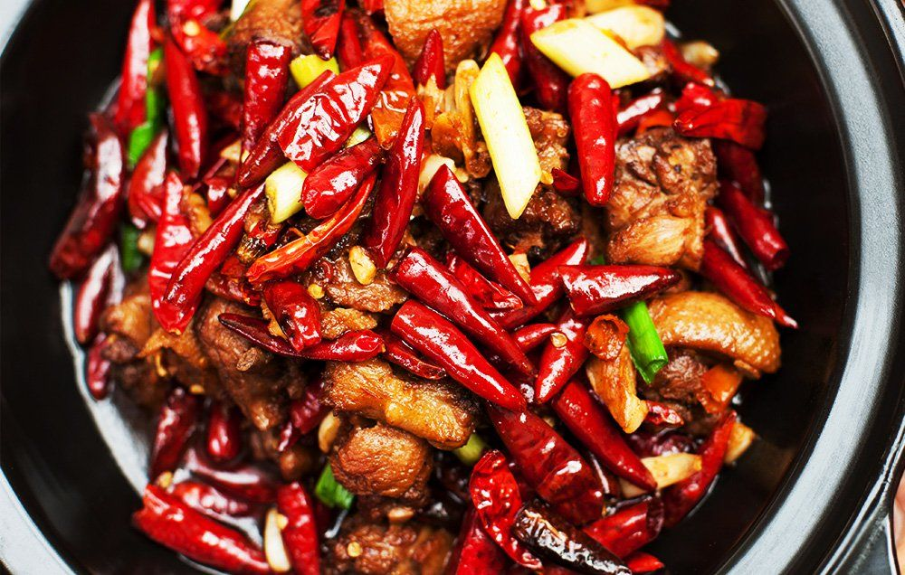
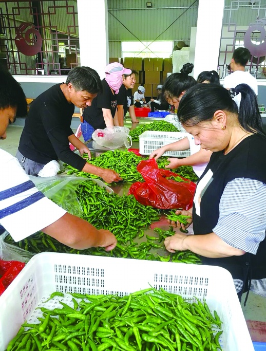

# Geography of Spice Tolerance

Preferences for spicy food are **polarizing**. You either *love* or *hate* them. In this article, I will explore the global differences in people's ability to tolerate spicy food and investigate the evolutionary explanation as to why [some regions](https://en.wikipedia.org/wiki/Hunan) have stronger spice tolerance than others.

## Evolutionary of Spice Tolerance
My favorite argument is ipsum lorem olor sit amet, consectetur adipiscing elit. Aenean quis porttitor ligula. Nulla orci leo, molestie eget diam id, porta gravida libero. Aenean luctus a diam nec vestibulum. Cras sit amet est eget est feugiat scelerisque ac sit amet metus. In aliquet lectus vel elit congue dignissim. Integer molestie euismod dapibus. Aliquam erat volutpat. Donec ultrices nulla elementum, vestibulum odio vel, viverra lorem. Vestibulum ut orci ut dolor laoreet dapibus. Etiam lacinia massa purus, non vestibulum tortor interdum vel. Aliquam metus augue, dapibus non eros in, gravida porttitor velit. Cras dolor eros, ullamcorper nec enim eget, tristique mollis quam. Nulla volutpat erat vitae arcu egestas rhoncus. Integer vitae felis suscipit, venenatis quam sed, commodo urna.

## Counterarguments
However, curabitur fringilla nisi vel lectus eleifend bibendum. Curabitur dapibus vestibulum risus, sit amet commodo lectus tempor nec. Vivamus bibendum faucibus odio, a maximus dolor ornare vel. Maecenas sagittis, metus eget vulputate condimentum, mauris mi accumsan risus, at lobortis nulla odio quis ipsum. Nulla suscipit tortor vitae tempus rhoncus. Sed gravida pretium felis. Morbi et est pharetra, lobortis neque sed, pellentesque tellus. Quisque mollis velit sed turpis interdum rutrum. Quisque lobortis quam eu pellentesque euismod.

## See also
- [Genetics of Spice Tolerance](https://www.keanhealth.com/blog/is-spice-tolerance-genetic#:~:text=The%20study%20found%20that%20there,does%20have%20ties%20to%20genetics.)
- [Science behind Spice Tolerance](https://thedishonscience.stanford.edu/articles/do-you-feel-the-burn-the-science-behind-your-spice-tolerance)
- [Why Some people can't eat spicy food](https://www.thrillist.com/health/nation/what-makes-some-people-like-spicy-food-and-others-hate-it)

## References
1. Törnwall, O. et al. Why do some like it hot? Genetic and environmental contributions to the pleasantness of oral pungency. Physiology & Behavior 107, 381-389 (2012).
2. Byrnes, N. K., and Hayes, J. E. Personality factors predict spicy food liking and intake. Food Quality and Preference 28, 213-221 (2013).
3. O’Neill, J. et al. Unravelling the Mystery of Capsaicin: A Tool to Understand and Treat Pain. Pharmacological Reviews 64, 939-971 (2012).